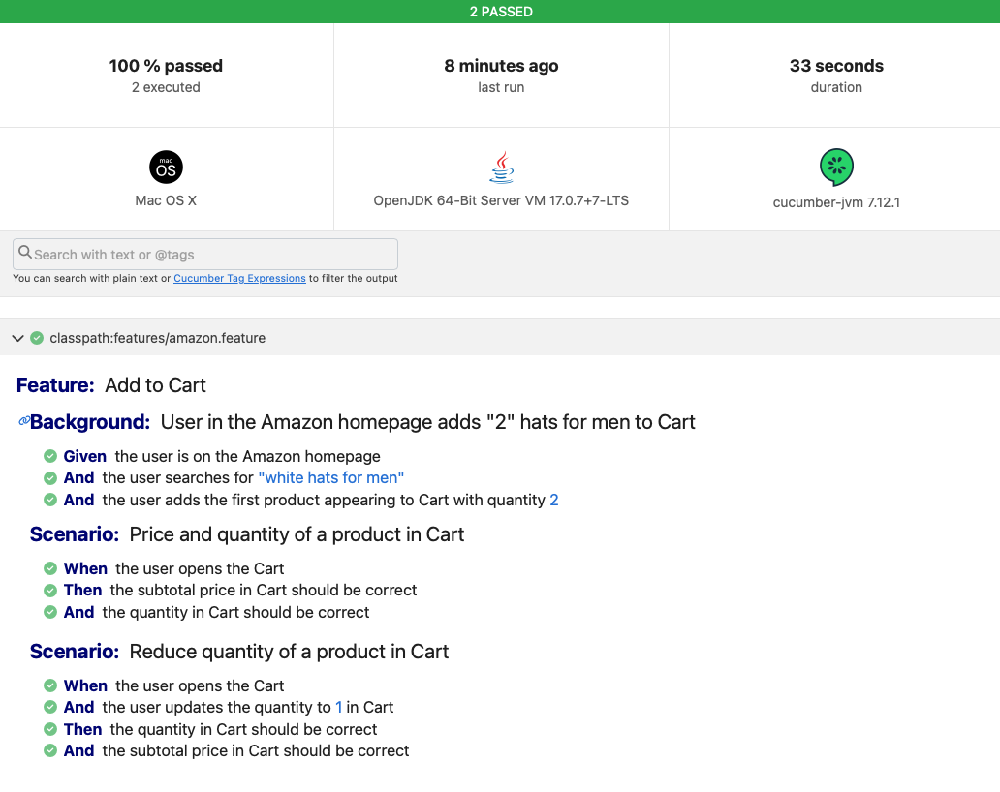

# Java Selenium Cucumber JUnit Test Automation Framework

Run the scenarios automated with the following command:

```bash
mvn clean test
```

After the scenarios are executed, a report will be generated in `report/cucumber-reports.html`. You can open this static html file in your browser to see the results.



## First task - scenario

Test scenarios for Facebook sign-up page in a text file using Gherkin language making sure to tackle all relevant test scenarios.

## Second task - automate 

1. Go to https://www.amazon.com
2. Search for "hats for men"
3. Add the first hat appearing to Cart with quantity 2
4. Open cart and assert that the total price and quantity are correct
5. Reduce the quantity from 2 to 1 in Cart for the item selected in the step 3
6. Assert that the total price and quantity has been correctly changed

## Setting up the environment

In order to run this, you will need the following tools installed in your system:
- java > 17
- maven > 3.9.3
- Firefox installed, the webdriver manager will download the driver for the right version

This configuration has been tested with windows, ubuntu and mac. Also, you can change the browser in the DriverFactory class.

## Problems to solve

- [x] Set a World to be able to share information between steps in a secure and reliable way
- [x] Use a webdriver manager
- [x] Basic html reporting
- [ ] browser setting from properties file
